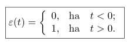
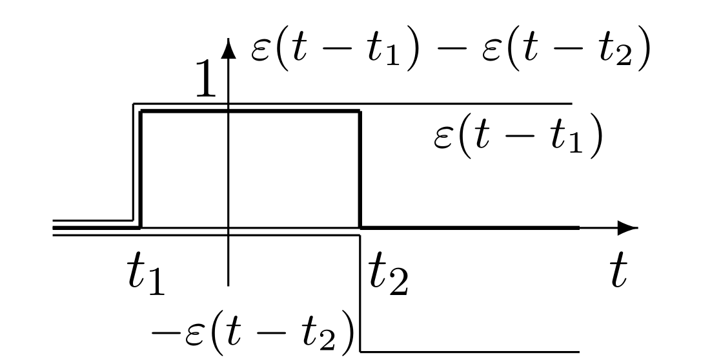
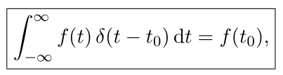
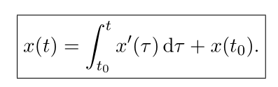

# Jelek/rendszerek gyorstalpaló

## Jel

A jel a fizikai mennyiség olyan értéke vagy értékváltozása, amely egy egyértelműen hozzárendelt információt hordoz. A jel tehát információtartalommal bír.

### Megadás

1. Képlet
2. Grafikus
3. Diffegyenlet / Rekurziv formula
4. Felsorolás

## Rendszerleíró jelek

### Egységugrásjel

t=0 időpontban nem definiált!

El lehet tolni, úgy igazán hasznos:

#### Ablakozás

Gyakorlatban is igen hasznos művelet. Elő tudunk állítani egy t_1 és t_2 közötti tartományon kívül 0 értékű jelet a következő módon:

### Dirac-impulzus

Egységnyi intenzitású impulzus.

Ablakozáshoz hasonlóan lehet használni:

### Általánosított derivált

x(t) általánosított deriváltja x'(t), ha fennál:

Dirac delta integrálja:

..amit ha összerakunk az általánosított derivált definiciójával:

### Jelek további osztályozása

* Sztochasztikus - determinisztikus
* Páros - páratlan
* Korlátos
* ...

## Rendszer

A rendszer egy fizikai objektum valamilyen modellje amely matematikailag leírja annak működését. Lehet SISO vagy MIMO.

Fontos tulajdonságok:

### Lineáris

a rendszerre érvényes a szuperpozíció elve, W operátor lineáris.

### Invariáns

A gerjesztés időbeli eltolása azt eredményezi, hogy a válaszban csak egy ugyanekkora időbeli eltolódás következik be:

### Kauzális

A rendszer válaszának adott időpontbeli értéke nem függ a gerjesztés jövőbeli értékétől.

### GV-stabil

Bármely korlátos gerjesztésre korlátos választ ad. (bibo)

## Válasz összetevők

