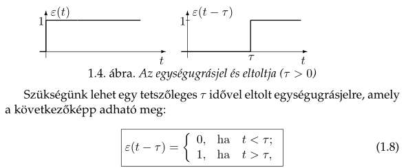

# Irányítás

## Jelek/rendszerek gyorstalpaló

### Jel

A jel a fizikai mennyiség olyan értéke vagy értékváltozása, amely egy egyértelműen hozzárendelt információt hordoz. A jel tehát információtartalommal bír.

#### Megadás

1. Képlet
2. Grafikus
3. Diffegyenlet
4. Felsorolás

### Rendszerleíró jelek

#### Egységugrásjel

t=0 időpontban nem definiált!

El lehet tolni, úgy igazán hasznos:

##### Ablakozás

Gyakorlatban is igen hasznos művelet. Elő tudunk állítani egy t_1 és t_2 közötti tartományon kívül 0 értékű jelet a következő módon:

#### Dirac-impulzus

Egységnyi intenzitású impulzus.

Ablakozáshoz hasonlóan lehet használni:

### Általánosított derivált

x(t) általánosított deriváltja x'(t), ha fennál:

Dirac delta integrálja:

..amit ha összerakunk az általánosított derivált definiciójával:

## Irányítás

Egy **folyamatba** való **beavatkozás** valamely **cél** elérése érdekében.

### Vezérlés - open-loop control

Az irányított jellemzőről szerzett valós idejű információ nem vesz részt az irányításban, nincs visszacsatolás.

### Szabályozás - closed-loop control

A szabályozás zárt láncú irányítás. A negatív visszacsatolást tartalmazó rendszer önműködő, zavartűrő, de a stabilitásra gondot kell fordítani.

### Analóg - Digitális

## Sources

http://maxwell.sze.hu/JELEK/Jelek_es_rendszerek.pdf