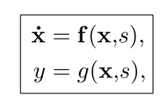
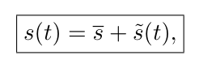
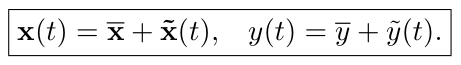
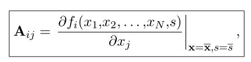
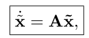
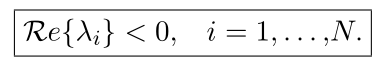
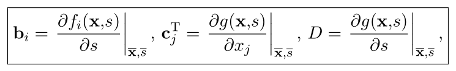
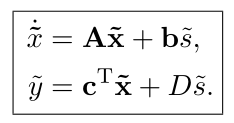

# Modellezés

## Modellezés

todo

## Munkaponti linearizálás

nemlin rendszer:

ha a gerj:

ahol s a gerjesztés ami egy állandó és egy kis értékkel változó jel összegeként írható fel.

Az állandó tag által meghatározott egyensúlyi állapotban ekkor a nemlin. rendszer linearizálható.

Gerj. és válasz:

1. Egyensúlyi állapotok meghatározása (állapotvektor deriváltjának nullhelye)
2. Egyensúlyi állapot stabilitásvizsgálata (jacobi + munkapont értékek + saját értékek bal félsíkon)
3. Lin rendszer válaszának számítása

  

