# Jelek 2

Ha ismerjük egy rendszer adott jelhez tartozó válaszát akkor meghatározható tetszőleges gerj.-hez tartozó válasza is.

## Ugrásválasz

Egységugrás jelre adott válasz:

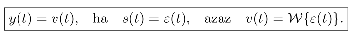

### Válasz számítása

A gerjesztés becsülhető egységugrásokkal, így:

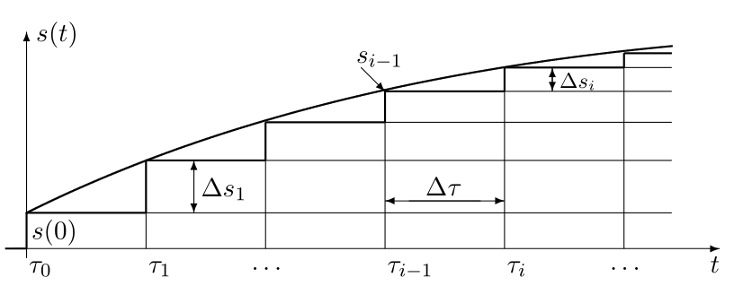

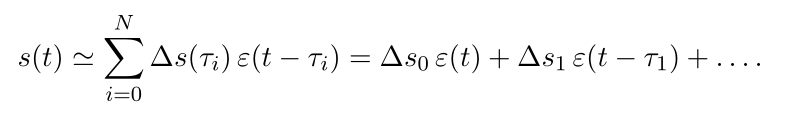

Linearitás, kauzalítás és invariancia miatt:

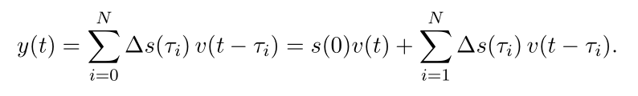

átalakítva:

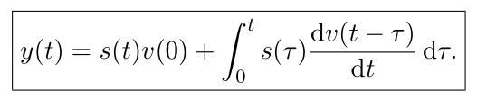

Ez a Duhamel tétel.

## Impulzusválasz

A Dirac-delta jelre adott válasz:

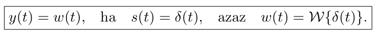

* Rendszerjellemző jel
* kauzális > belépőjel
* stbstb

### Válasz számítása

Hasonlóan az ugrásválaszhoz:

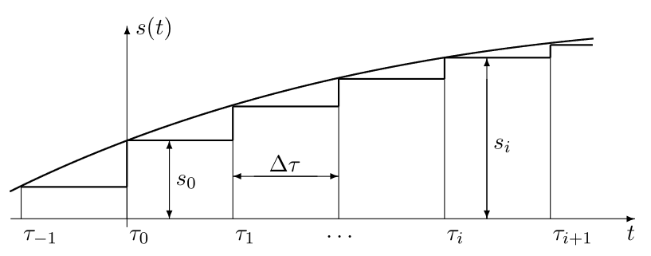

A gerj. végtelen sok eltolt és súlyozott Dirac-impulzus összege:

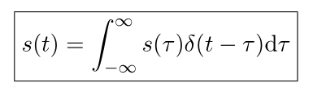

A válasz pedig:

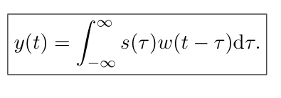

Kauzális rendszer esetén, belépő gerjesztéskor:

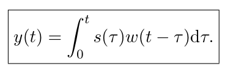

## Átviteli függvény

Az impulzusválasz Laplace transzformáltja, megadja a gerjesztés válasz kapcsolatot a komplex frek. tartományban:

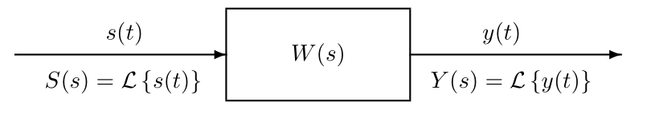

## Átviteli karakterisztika

FI, lin, invariáns, kauzális, GV stab rendszer válaszának szabad összetevője a nullához tart.

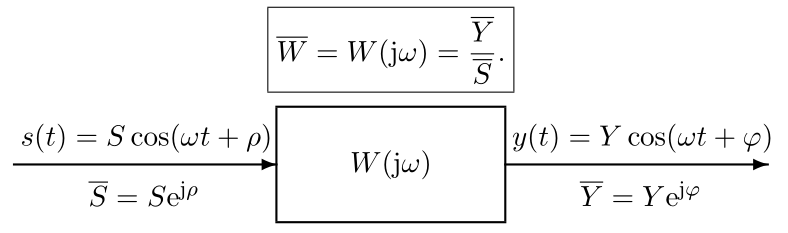