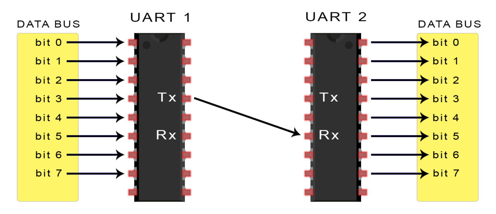
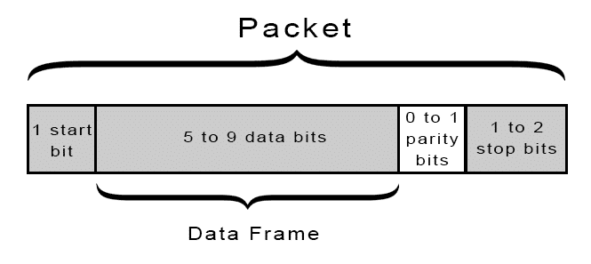
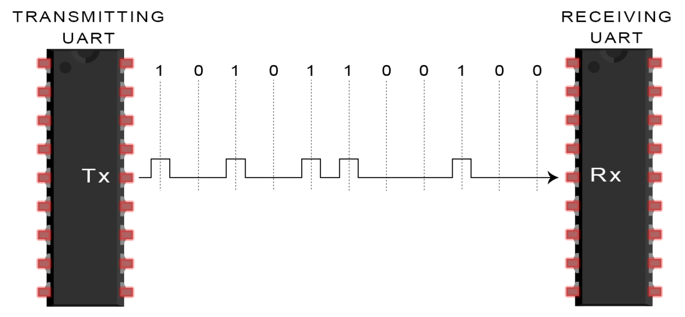

# UART alkalmazása, programozása

## UART

Universal asynchronous receiver-transmitter -> Univerzális 
aszinkron adóvevő. Tehát nem busz, csak p2p. Nem is igazán protokoll, inkább csak egy eszköz amit szinte minden MCU-ban megtalálunk.

> translates data from the computer bus's internal parallel format to serial and back.

* 1 start bit (low)
* 5-9 data bits
* optional parity bit
* 1-2 stop bits (high)

## Baud rate

Also knows as *symbol* rate. A symbol is a waveform, a state or a significant condition of the communication channel that persists, for a fixed period of time. The rate of which these symbols get placed on the transmission line is the baud rate.

The baud rate must be the same (or ~10% close at least) between RX and TX. Character length, parity, and stop bits also need to match.

## UART programming (PIC)

Hogy legyen mivel kommunikálnia a MCU-nak, szükségünk van egy USB-UART interfészre ami szerencsére megtalálható a legtöbb PIC fejlesztő boardon. A következőket kell beállítani az uC-n:

1. UxBRG regiszterrel a PBCLK alapján megadni a baud rate-et
2. UxMODE regiszterrel konfigurálni az minden mást

## Sources

https://learn.sparkfun.com/tutorials/serial-communication/uarts
https://www.arrow.com/en/research-and-events/articles/what-is-uart-protocol-uart-communication-explained
https://www.digikey.com/eewiki/display/microcontroller/Getting+Started+with+the+PIC32+and+MPLAB+X#GettingStartedwiththePIC32andMPLABX-UARTConfiguration