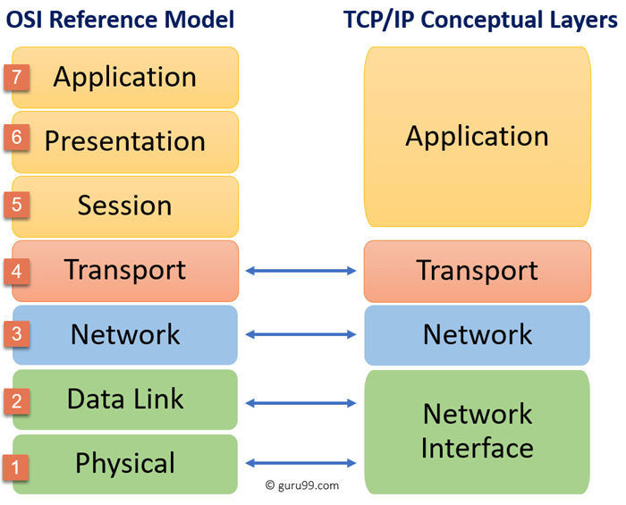
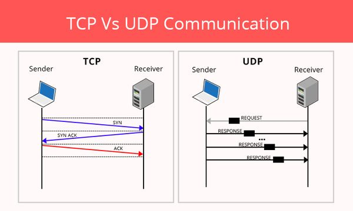
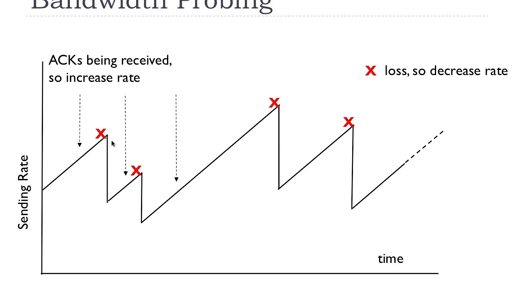

# TCP - IOT

## TCP

TCP is the dominant transport layer protocol of the internet, but it faced significant challenges as the Internet has evolved beyond its initial characteristics.

## Congestion control problems

TCP congestion control was not designed for IoT applications, where packet losses can occur for reasons other than network congestion. Secondly, many IoT networks follow a mesh topology. Route changes, e.g. due to node mobility or temporary link quality degradation, lead to connectivity gaps and may also induce packet reordering (which TCP may treat as packet loss).

This is a well known issue. Proposed solutions include Explicit Loss Notification, which requires distinction of reasons for packet loss occuring. Note, that the inability to determine reason of packet loss is an problem not limited to TCP.

## Header overhead

* **TCP** header size = **20 bytes** > UDP header size = **8 bytes**
* UDP header can be compressed with 6LoWPAN
* Still an open issue

## Connection maintenance 

* IoT devices run on a limited energy source
* Radio Duty Cycling (RDC) can be used to keep the radio interface off by default

## Further problems

* latency
* always reliable service
* multicast

## Sources

https://www.researchgate.net/publication/322549192_TCP_in_the_Internet_of_Things_From_Ostracism_to_Prominence